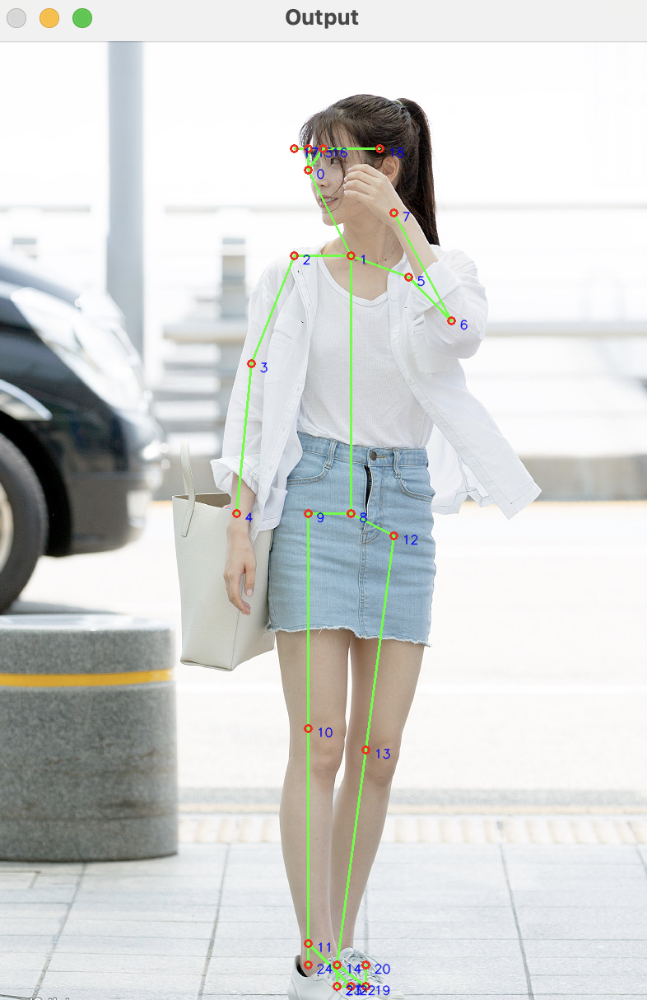

# dragon library
- project name : dragon  
- author : DaeYong.K  
- version : cappuccino  
- python version : 3.11.7
- dependency list : 
```
  - cv2 : 4.8.1
  - numpy : 2.0.9
  - json : 2.0.9
  - openpyxl : 3.1.2
  - pandas : 2.1.4
  - sklearn : 1.3.2
```
<p>
해당 프로젝트는 이미지나 영상에 코드를 작성할 때, 지루하고 반복적인 작업을 막기 위해서 시작했습니다. openpose를 사용하는 작업에 특화되어 있습니다. 라이브러리를 사용하다가 필요한 기능이 있거나 오류를 발견하셨다면, github issue에 남겨주세요. 각 모듈의 자세한 사용법 및 예시코드는 doc를 참고바랍니다.
</p>

## 특징
쉽다!<br>
### example code
```python
import cv2
from dragon import dragonImg25 as d25

image = cv2.imread(image_path)
net = d25.get_network(prototxt_body25_path, caffemodel_body25_path)

inblob = d25.preprocess_image_blob(image)
net.setInput(inblob)
output = net.forward()

joint_pos_list, confidence_list = d25.get_position_from_netoutput(output, image)
d25.show_marked_image(image, joint_pos_list, confidence_list)
```
### result
<p align='center'>
    
</p>